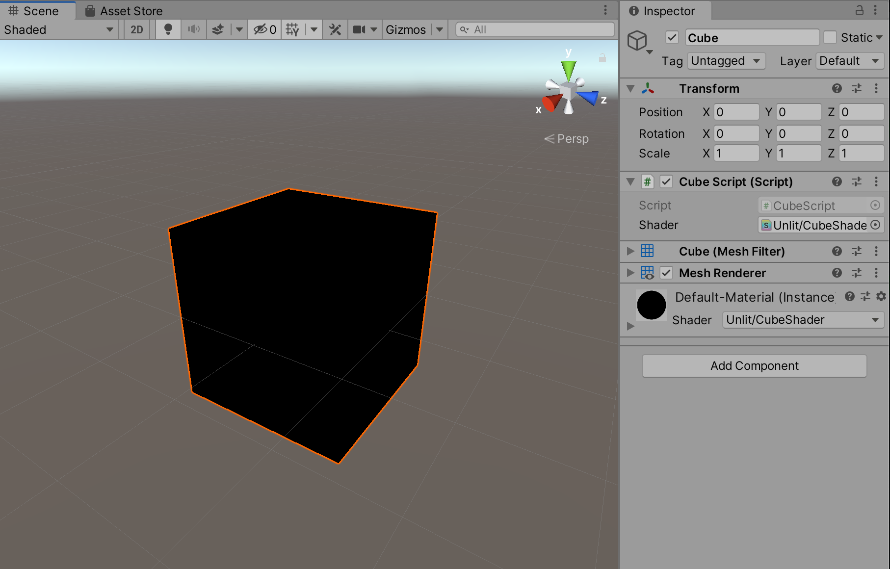
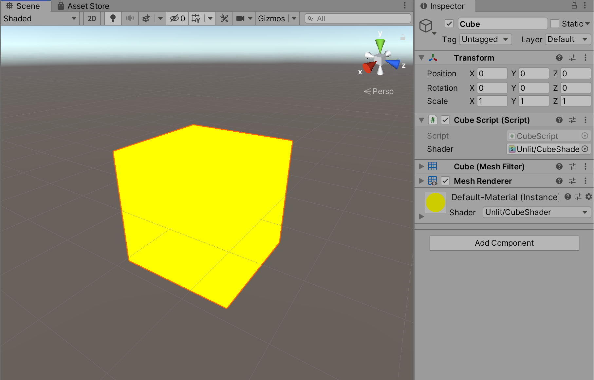
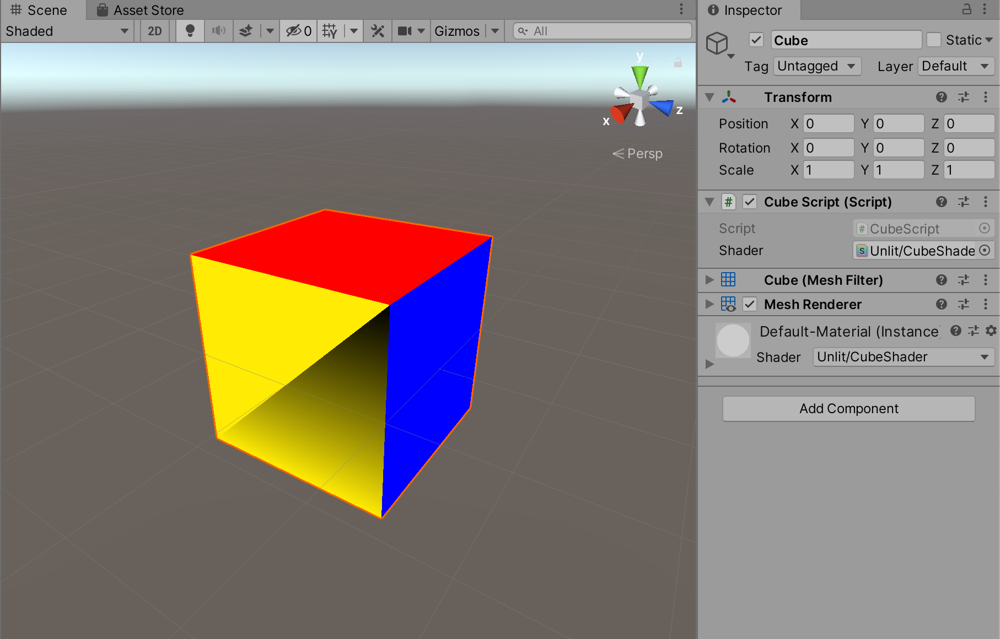
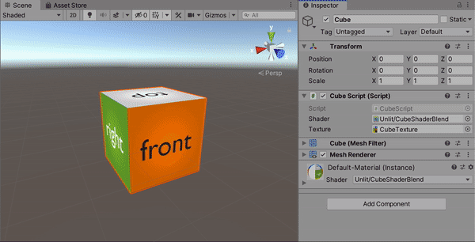

**The University of Melbourne**
# COMP30019 – Graphics and Interaction

## Workshop 4

# Introduction:

In this lab you will delve into the weird and wonderful world of shader programming. Shaders allow us to programmatically define behaviour in the rendering pipeline which is executed on the GPU rather than the CPU. This lab is only a basic introduction to shaders; for instance, in a future lab you will see how to implement a full lighting model inside a shader.

You will need to work with three files to start off with:
* **MainScene.unity** – A Unity scene containing a cube entity. This is the scene you’ll be modifying in today’s lab.
* **CubeScript.cs** – The C# script which constructs and renders the cube geometry, attached to the cube entity. This is executed on the CPU when the project runs.
* **CubeShader.shader** – A Cg/HLSL shader which defines behaviour in parts of the rendering pipeline. Note that this is **not** executed on the CPU, but rather the GPU (on a graphics card).

You may notice there are a couple of other assets in the project, but for now, the above three are the only relevant ones.

# Task:

1. Open `MainScene.unity` in Unity. Press the ‘Play’ button and take a look at the cube (it might be best to look at the cube from the ‘Scene’ tab, since you can play around with it then). Currently it is rendered pink - this is because we have not assigned it a shader. Your first task is to modify `CubeScript.cs` to assign the custom `CubeShader.shader` to the cube’s material. When you are successful, the cube should be rendered black.

  

2. Examine the shader code (`CubeShader.shader`).
* What is the code mul(UNITY_MATRIX_MVP, v.vertex) doing?
* Which line is responsible for the cube being rendered black? Modify the shader to
output the cube in yellow instead.

  

3. Modify the shader to handle vertex colours, so that the cube is rendered based on the vertex
colours defined in `CubeScript.cs`. Hint: You will need to modify the structures `vertIn` and `vertOut`, as well as make small modifications to the vertex and fragment shaders themselves. The COLOR semantic should come in handy.

  

4. Change any single vertex colour in `CubeScript.cs` so that one triangle does not have all identical vertex colours. How is the triangle rendered differently? What ‘magic’ happens between the vertex and fragment shaders to facilitate this effect?

  

Vertex colours are the most basic way to colour a 3D mesh. As an alternative, we may wish to use a texture, which provides far more detail. A texture is an image which is typically “wrapped” onto 3D geometry, by specifying a ‘UV coordinate’ for each vertex (as opposed to a colour for each vertex). You can think of a UV coordinate as a position on a texture represented as a fraction. For instance, in Unity the UV coordinate (0.0, 0.0) represents the colour at the very bottom-left of the texture, (0.5, 0.5) represents the colour in the middle of the texture, and (1.0, 1.0) represents the colour at the top- right of the texture.

For the next questions there are two other files of interest:
* **CubeShaderTex.shader** – A Cg/HLSL shader with texture capabilities.
* **CubeTexture.png** – A texture image that we want to correctly “wrap” on the faces of the cube. 

It might be worth taking a look at `CubeTexture.png` before continuing.

5. You have been given a shader with basic texture capacities: `CubeShaderTex.shader`. Open it and try to comprehend what’s going on.
* How does this shader differ from the colour shader you just wrote? What does the built-in function tex2D do?
* Modify CubeScript.cs to use this shader. You’ll also need to modify the material used by the MeshRenderer component such that it references a texture object (the image). It will probably be easiest to reference the texture via a public attribute so it can be attached to the script in the Unity interface. In any case, make sure CubeTexture.png is the texture image being used. When it is working, you should notice the cube is partially textured correctly.
* Parts of the cube are textured incorrectly or not at all. Locate and fix the erroneous UV coordinates in `CubeScript.cs`.

  

6. **Challenge** Write a shader that blends both texture and colour outputs. For each fragment, if ct is the sampled texture colour and cc is the interpolated vertex colour, then the output should be ct * f + cc * (1 - f), where f is the blending factor. Start off with f being hardcoded as 0.5. Then, for an extra challenge make f a uniform parameter of the shader so it can be set externally.

  

